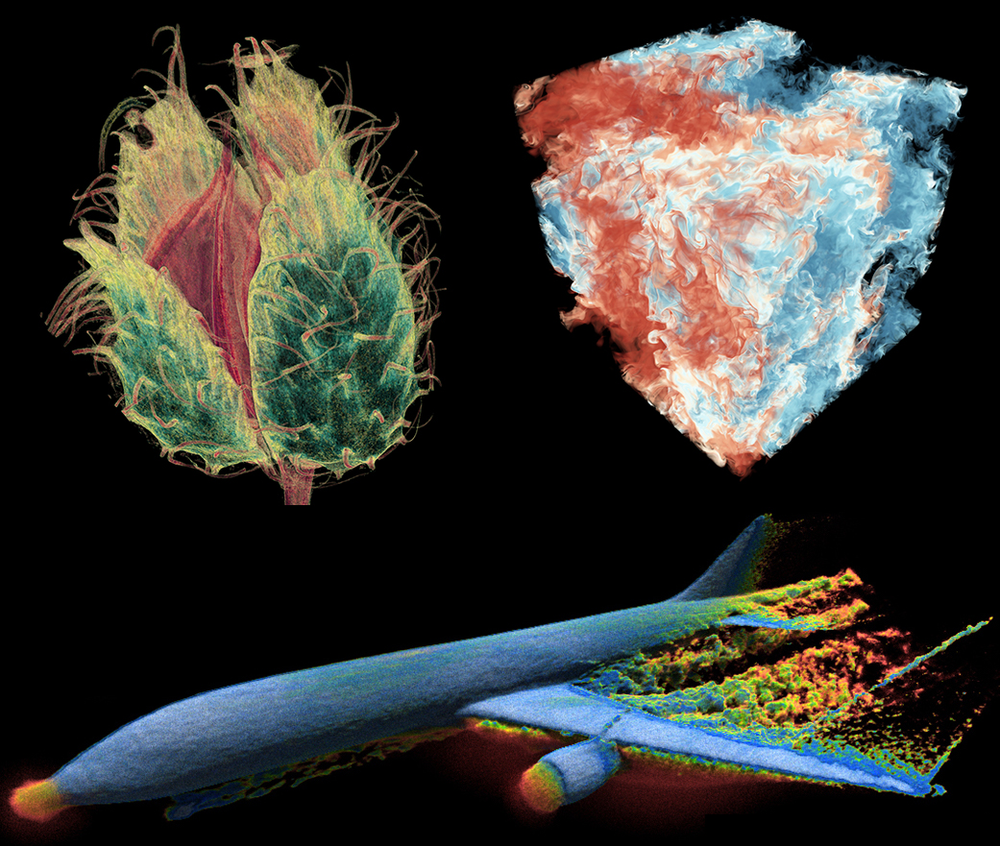

# instantvnr-py

Python distribution of [VIDILabs/instantvnr](https://github.com/VIDILabs/instantvnr): real-time ray tracing of volumetric neural representations.

[](#license)
[](https://www.python.org/)
[](https://developer.nvidia.com/cuda-downloads)
[](https://doi.org/10.1109/TVCG.2023.3306859)
[](https://arxiv.org/abs/2207.11620)

## About

`instantvnr-py` packages the C++/CUDA renderer from [`VIDILabs/instantvnr`](https://github.com/VIDILabs/instantvnr) as an installable Python wheel. The renderer implements *Interactive Volume Visualization via Multi-Resolution Hash Encoding Based Neural Representation* (Wu et al., IEEE TVCG 2024) — multi-resolution hash-encoded neural volumes, macro-cell accelerated path / ray tracing, and live in-loop training.

The C++ core lives under `ext/`. The OVR rendering framework ([`VIDILabs/open-volume-renderer`](https://github.com/VIDILabs/open-volume-renderer)) is vendored as the `ovr/` submodule. Build orchestration goes through [scikit-build-core](https://scikit-build-core.readthedocs.io/) + CMake and is driven by [`uv`](https://docs.astral.sh/uv/).




## Features

- HashGrid + FullyFusedMLP neural-volume training via [tiny-cuda-nn](https://github.com/NVlabs/tiny-cuda-nn)
- Path tracing, ray marching, gradient-shaded ray marching, and shadow-map rendering modes
- Macro-cell space partitioning for empty-space skipping
- Headless batch renderer plus two interactive OpenGL viewers (single-volume and dual-view with live training)
- PyTorch interop: a `vnr_network` pybind11 module alongside standalone shared libs (`libivnr.so`, `libdevice_hyperinr.so`)
- Console scripts: `vnr-batch`, `vnr-int-single`, `vnr-int-dual`

## Repository layout

- `ext/` — C++/CUDA core
  - `api.{h,cpp}`, `serializer.{h,cpp}` — public C API and scene I/O
  - `core/` — neural networks, samplers, volume representations
  - `device/` — CUDA renderer (path tracing, ray marching, shadow maps)
  - `apps/` — `batch_volume`, `int_volume`, `int_dual_volume` CLI sources
- `ovr/` — vendored OVR rendering framework (git submodule)
- `python/` — `instantvnr` Python package (`__init__.py`, `apps.py` launchers)
- `tests/` — pytest suite (currently `test_runtime_libs.py`)
- `setup_venv.sh`, `pyproject.toml`, `CMakeLists.txt` — build entry points

## Requirements

- Linux (tested on Ubuntu)
- NVIDIA GPU, compute capability `sm_70`+ (Blackwell `sm_120`+ uses PyTorch nightly)
- CUDA toolkit 11.8 / 12.1 / 12.4 / 12.8 — `setup_venv.sh` auto-detects via `nvcc`
- Python 3.11 or newer
- [`uv`](https://docs.astral.sh/uv/) package manager
- OpenGL + GLFW dev headers for the interactive viewers: `sudo apt install libglfw3-dev`

## Quick install

```bash
git clone --recurse-submodules https://github.com/VIDILabs/instantvnr.git
cd instantvnr-py
./setup_venv.sh                  # auto-detect GPU and CUDA
# or:  SM=86 ./setup_venv.sh     # override GPU arch (skip nvidia-smi)
source .venv/bin/activate
```

`setup_venv.sh` creates `.venv/`, downloads ISPC into it, picks the right PyTorch wheel index for the detected CUDA / GPU, and runs `uv pip install -v .[test]` — which builds tiny-cuda-nn from source and the C++ extension via CMake in one step.

## Manual build

If you'd rather invoke `uv` directly without the helper script:

```bash
uv pip install . \
  --config-settings "cmake.define.CMAKE_CUDA_ARCHITECTURES=86"
```

Relevant CMake variables (defaults in `pyproject.toml`):

- `CMAKE_CUDA_ARCHITECTURES` — target GPU arch (`native`, `86`, `89`, `90`, `120`, …)
- `TCNN_REPOSITORY` — tiny-cuda-nn fork (defaults to a wilsonCernWq fork pinned by commit)
- `TCNN_COMMIT_HASH` — pinned tiny-cuda-nn commit

## Usage

### Console scripts

```bash
vnr-batch --simple-volume scene.json --output frame.png \
          --width 1024 --height 1024 --rendering-mode 0

vnr-int-single --neural-volume params.json

vnr-int-dual --volume scene.json --network params.json
```

Rendering modes (see `ext/api.h`):

- `0` ray marching
- `1` ray marching + gradient shading
- `2` ray marching + single-scattering
- `3` ray marching + shadow map
- `4` path tracing

### Python API

```python
from instantvnr.apps import run_batch

run_batch(
    simple_volume="scene.json",
    output="frame.png",
    width=1024,
    height=1024,
    rendering_mode=0,
)
```

`run_int_single` and `run_int_dual` wrap the interactive viewers with the same keyword-argument style.

## Testing

```bash
pytest tests/
```

`test_runtime_libs.py` checks that every shared library shipped in the installed package resolves its `DT_NEEDED` entries (no `'not found'` from `ldd`, no ephemeral build-cache paths leaking into `NEEDED`).

## Citation

If you use this work, please cite the paper. If you use this Python distribution specifically, also cite the software entry. Both BibTeX entries live in [`CITATION.bib`](./CITATION.bib).

```bibtex
@article{wu2024interactive,
  title   = {Interactive Volume Visualization via Multi-Resolution Hash Encoding Based Neural Representation},
  author  = {Wu, Qi and Bauer, David and Doyle, Michael J. and Ma, Kwan-Liu},
  journal = {IEEE Transactions on Visualization and Computer Graphics},
  volume  = {30},
  number  = {8},
  pages   = {5404--5418},
  year    = {2024},
  publisher = {IEEE},
  doi     = {10.1109/TVCG.2023.3306859},
  url     = {https://arxiv.org/abs/2207.11620}
}

@software{wu2026instantvnrpy,
  author  = {Wu, Qi},
  title   = {{instantvnr-py}: {Python} distribution of {Instant} {Volume} {Neural} {Representation}},
  year    = {2026},
  version = {0.1.0},
  license = {Apache-2.0},
  url     = {https://github.com/VIDILabs/instantvnr}
}
```

## License

Apache-2.0 — see [`LICENSE`](./LICENSE). Third-party components vendored under `ext/` and `ovr/`, plus build-time dependencies fetched via CMake `FetchContent` and pip, retain their own licenses; they are summarized in [`NOTICE`](./NOTICE).

## Acknowledgements

- [VIDILabs](https://github.com/VIDILabs) — original `instantvnr` and `open-volume-renderer`
- [tiny-cuda-nn](https://github.com/NVlabs/tiny-cuda-nn) — fast neural network primitives
- [OptiX 7](https://developer.nvidia.com/optix) and [OSPRay](https://www.ospray.org/) — referenced in OVR (optional, not built by default here)
